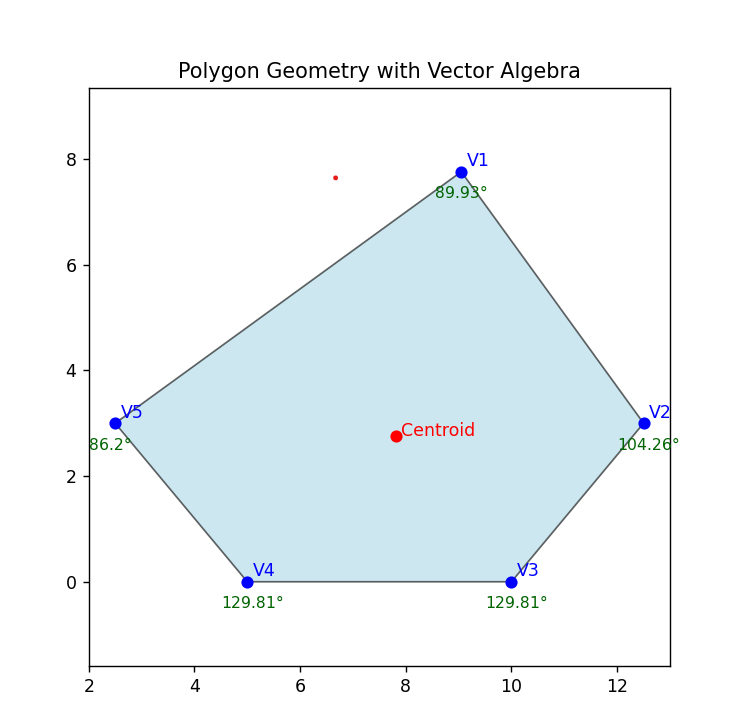
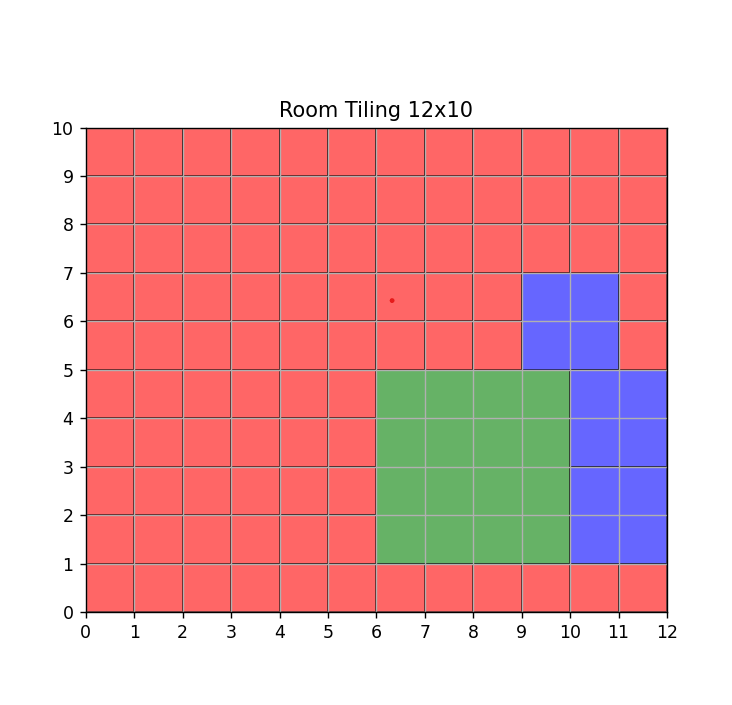
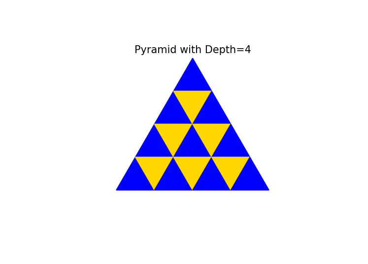

# 📘 README — Assignments 1–3

## 🧰 Dependencies

> Python 3.9–3.12 recommended

```txt
numpy>=1.26
pandas>=2.2
matplotlib>=3.8
shapely>=2.0
openpyxl>=3.1
XlsxWriter>=3.2
```

Install with:

```bash
pip install -r requirements.txt
```

---
## 📸 Outputs

### Assignment 1a – Student Marks
- `outputs/results_task1a.xlsx` with 2 sheets (Summary + Top Performers) and embedded **bar chart**  


### Assignment 1b – Polygon Geometry
- `outputs/polygon_plot_task1b.png` — filled polygon with vertex labels, centroid (red), interior angle annotations  


### Assignment 2 – Room Tiling
- `outputs/tiling_roomtask2.png` — spiral tiling visualization, colored by tile size (1×1 red, 2×2 blue, 3×3 yellow, 4×4 green)  


### Assignment 3 – Triangle Pyramid
- `outputs/triangle_pyramidtask3.png` — pyramid of alternating upright/inverted triangles  


---

All outputs are saved in the `outputs/` directory.
